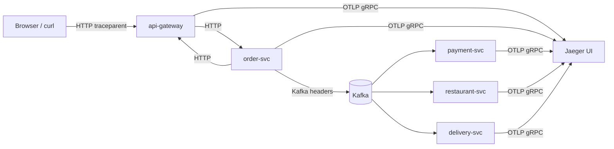

# Распределённая трассировка (OpenTelemetry + Jaeger)

Как в проекте устроена трассировка запросов через gateway, HTTP между сервисами и Kafka-сагу заказа.

Связанные документы: [Architecture.md](./Architecture.md).

---

## Зачем это нужно

Один заказ проходит через **api-gateway → order-svc → Kafka → payment / restaurant / delivery / notification**. Без трассировки сложно понять:

- где потерялось время;
- какой сервис упал или вернул ошибку;
- связаны ли события Kafka с исходным HTTP-запросом клиента.

Трассировка собирает **один trace** на весь путь: от `POST /api/orders` до `order.delivered` в Kafka.

---

## Стек

| Компонент | Роль |
|-----------|------|
| **OpenTelemetry SDK** (`pkg/telemetry`) | Инициализация, экспорт спанов |
| **OTLP gRPC** | Протокол отправки в коллектор |
| **Jaeger all-in-one** | Хранение и UI (Docker Compose) |
| **otelhttp** | Авто-спаны для входящего и исходящего HTTP |
| **W3C Trace Context** | Пропагация `traceparent` в HTTP и Kafka |

Трассировка **опциональна**: если `OTEL_EXPORTER_OTLP_ENDPOINT` пустой, сервисы работают как раньше, без накладных расходов на экспорт.

---

## Быстрый старт

```bash
make up ENV=dev
make docs   # покажет URL Jaeger UI
```

1. Откройте **Jaeger UI**: http://localhost:16686  
2. Создайте заказ через фронтенд или `make demo`.  
3. В Jaeger выберите сервис **api-gateway** → **Find Traces**.  
4. Откройте trace — увидите цепочку HTTP и Kafka-спанов.

Порты (переопределяются в `deploy/env/dev.env`):

| Переменная | По умолчанию | Назначение |
|------------|--------------|------------|
| `JAEGER_UI_PORT` | `16686` | Web UI |
| `JAEGER_OTLP_PORT` | `4317` | OTLP gRPC приёмник |

---

## Переменные окружения

| Переменная | Обязательна | Описание |
|------------|-------------|----------|
| `OTEL_EXPORTER_OTLP_ENDPOINT` | Нет | Адрес OTLP gRPC (`jaeger:4317` в Docker, `localhost:4317` локально). Пусто = tracing off |
| `OTEL_TRACES_SAMPLER_ARG` | Нет | Доля трассируемых **корневых** запросов `0.0`–`1.0`. Дочерние спаны наследуют trace (ParentBased sampler) |

В `deploy/env/dev.env` по умолчанию:

```env
OTEL_EXPORTER_OTLP_ENDPOINT=jaeger:4317
OTEL_TRACES_SAMPLER_ARG=1.0
```

Имя сервиса в Jaeger задаётся в коде при `telemetry.Init(ctx, "order-svc")` — не через env.

Чтобы **отключить** трассировку в dev, очистите `OTEL_EXPORTER_OTLP_ENDPOINT` в env-файле.

---

## Архитектура инструментирования



### HTTP (входящий)

Каждый сервис оборачивает роутер:

```go
telemetry.WrapHTTP(serviceName, handler)
```

Создаётся span вида `api-gateway` / `order-svc` с атрибутами `http.method`, `http.route`, `http.status_code`.

### HTTP (исходящий)

Клиенты используют `telemetry.HTTPClient(timeout)`:

- **api-gateway** → backend-сервисы (`pkg/.../proxy`);
- **order-svc** → user-svc, restaurant-svc;
- **delivery-svc** → order-svc.

Заголовок `traceparent` передаётся автоматически — дочерний span связывается с родителем.

### Kafka

В `pkg/kafka`:

- **Producer** — `injectTraceContext`: W3C-заголовки (`traceparent`, `tracestate`) в headers сообщения; span `kafka.publish <topic>`.
- **Consumer** — `extractTraceContext` из headers; span `kafka.consume <topic>`; handler получает `ctx` с активным trace.

Так сага заказа остаётся **одним trace**, даже когда шаги асинхронные.

---

## Пример trace: успешный заказ

Типичная последовательность после `POST /api/orders`:

| # | Сервис | Span / событие |
|---|--------|----------------|
| 1 | api-gateway | `POST /api/orders` |
| 2 | order-svc | `POST /orders` (через proxy) |
| 3 | order-svc | `kafka.publish order.created` |
| 4 | payment-svc | `kafka.consume order.created` |
| 5 | payment-svc | `kafka.publish payment.processed` |
| 6 | order-svc | `kafka.consume payment.processed` |
| 7 | order-svc | `kafka.publish order.paid` |
| 8 | restaurant-svc | `kafka.consume order.paid` |
| 9 | restaurant-svc | `kafka.publish order.ready` |
| 10 | delivery-svc | `kafka.consume order.ready` |
| 11 | delivery-svc | HTTP к order-svc (адрес доставки) |
| 12 | delivery-svc | `kafka.publish courier.assigned` → `order.delivered` |
| 13 | order-svc | `kafka.consume ...` (обновление статуса) |
| 14 | notification-svc | `kafka.consume ...` (параллельные спаны на каждый топик) |

В Jaeger это выглядит как **дерево**: корень — gateway, ветки — HTTP к order-svc и цепочка Kafka consumer/producer между сервисами.

---

## Пример trace: компенсация (refund)

При `KITCHEN_FAIL_RATE > 0` или `DELIVERY_FAILED`:

1. `order.preparation.failed` / `delivery.failed` → order-svc  
2. `payment.refund.requested` → payment-svc  
3. `payment.refunded` → order-svc → статус `REFUNDED`  

Все шаги остаются в **том же trace**, что и исходный заказ (если Kafka propagation сработала). Удобно отлаживать сагу отката.

---

## Пакет `pkg/telemetry`

| Функция | Назначение |
|---------|------------|
| `Init(ctx, serviceName)` | OTLP exporter, TracerProvider, propagator; возвращает `shutdown` |
| `WrapHTTP(name, handler)` | Middleware для входящих запросов |
| `HTTPClient(timeout)` | Исходящий HTTP с propagation |
| `Tracer(name)` | Ручные спаны (при необходимости) |
| `Enabled()` | Проверка, задан ли OTLP endpoint |

Инициализация в `cmd/main.go` каждого сервиса:

```go
shutdown, err := telemetry.Init(context.Background(), serviceName)
defer func() { _ = shutdown(context.Background()) }()
```

Sampler: `ParentBased(TraceIDRatioBased(OTEL_TRACES_SAMPLER_ARG))` — если родительский span уже sampled, дети тоже; иначе решает ratio для новых корневых trace.

---

## Jaeger UI — что смотреть

1. **Service** — фильтр по `api-gateway`, `order-svc`, …  
2. **Operation** — `POST /api/orders`, `kafka.consume order.created`, …  
3. **Trace Timeline** — длительность каждого span; красный = ошибка (`RecordError`).  
4. **Tags** — `http.status_code`, `messaging.destination`, `messaging.event_type`, `deployment.environment`.  

Совет: найдите trace по `order-svc` и operation `kafka.publish order.created`, затем перейдите к **Trace ID** — увидите полную сагу.

---

## Локальная разработка без Docker

1. Запустите Jaeger: `docker run -d -p 16686:16686 -p 4317:4317 -e COLLECTOR_OTLP_ENABLED=true jaegertracing/all-in-one:1.57`  
2. Запустите сервис с env:  
   `OTEL_EXPORTER_OTLP_ENDPOINT=localhost:4317 go run ./cmd`  
3. UI: http://localhost:16686  

---

## Stage / Prod

В `deploy/env/stage.env.example` и `prod.env.example` заданы примеры с **пониженным sampling** (`0.1` / `0.05`), чтобы не перегружать коллектор.

В Kubernetes обычно:

- Jaeger / Tempo / Grafana Alloy как OTLP backend;
- тот же `OTEL_EXPORTER_OTLP_ENDPOINT` на sidecar или cluster DNS;
- sampling 1–10% на prod.

Helm-чарт для OTEL/Jaeger в репозитории пока не включён — только Compose для dev.

---

## Ограничения текущей реализации

| Тема | Статус |
|------|--------|
| Метрики / логи | Только traces, не metrics/logs |
| Frontend | Браузер не шлёт trace в gateway (можно добавить W3C fetch позже) |
| Бизнес-атрибуты | `order.id` в спанах не везде — при необходимости `telemetry.Tracer().Start` в handler |
| Kafka lag | Span consumer'а покрывает обработку сообщения, не время в очереди |
| notification-svc | Много consumer'ов — отдельные ветки trace на каждый топик |

---

## Отключение и troubleshooting

**Трассировка не появляется в Jaeger**

- Проверьте лог сервиса: `tracing enabled → jaeger:4317` или `tracing disabled`.  
- Убедитесь, что контейнер `jaeger` запущен: `docker compose ps jaeger`.  
- В dev sampling `1.0` — все корневые запросы должны попадать в UI.  
- Firewall: порт `4317` доступен из сети Docker.

**Слишком много trace в prod**

- Уменьшите `OTEL_TRACES_SAMPLER_ARG`.

**Kafka-спаны не связаны с HTTP**

- Проверьте, что producer и consumer используют `pkg/kafka` (propagation в headers).  
- Убедитесь, что `OTEL_EXPORTER_OTLP_ENDPOINT` одинаковый у всех сервисов.

---

## Кратко

- **Включение**: `OTEL_EXPORTER_OTLP_ENDPOINT=jaeger:4317` + `make up ENV=dev`.  
- **UI**: http://localhost:16686  
- **Один заказ = один trace** через HTTP propagation и Kafka headers.  
- **Код**: `pkg/telemetry`, `pkg/kafka/propagate.go`, `telemetry.Init` + `WrapHTTP` в каждом `main.go`.
